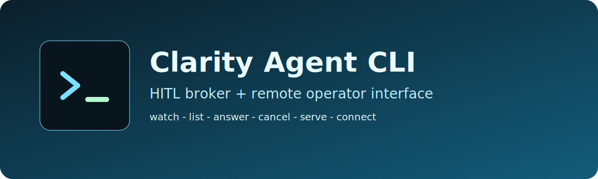

<p align="center">
  
</p>

<p align="center">
  <strong>Operator-first CLI for HITL broker workflows and runtime-agent chat in the Clarity ecosystem.</strong>
</p>

---

`clarity-agent-cli` is a standalone interface for connecting operators to running Clarity agents.

It follows the HITL broker contract defined in `docs/hitl-broker-spec.md` and supports three operation styles:

- local file-handshake mode (`.question` / `.answer` files)
- remote broker mode over HTTP/SSE (`/questions`, `/answer`, `/cancel`, `/events`)
- runtime-agent chat mode over `LLM-runtime` / `Clarity-runtime` APIs (`/api/agents/*`)

## Why this exists

Clarity agents can pause for human input (`hitl_ask`) while running on different hosts and runtimes.
This CLI gives one consistent interface for:

- watching and answering pending HITL questions
- exposing an HTTP broker API + lightweight web UI
- connecting to an existing broker and answering remotely
- listing runtime agents and chatting through run event streams
- maintaining auditable operator activity logs

## Architecture

```text
Clarity Agent Runtime                 Operator Interface
---------------------                 ------------------
hitl_ask(key, question)
        |
        | (file mode) write .question
        v
+----------------------+             +-------------------------+
| .clarity-hitl dir    |<----------->| clarity-agent watch     |
| {key}.question       |             | clarity-agent list      |
| {key}.answer         |             | clarity-agent answer    |
+----------------------+             | clarity-agent cancel    |
                                     +-------------------------+

        | (http mode)
        v
+----------------------+             +-------------------------+
| clarity-agent serve  |<----------->| clarity-agent connect   |
| /questions           |             | (remote broker client)  |
| /answer              |             +-------------------------+
| /cancel              |
| /events (SSE)        |
+----------------------+
```

## Install and run

```bash
npm install
npm run build

# local file mode
npx clarity-agent watch

# list pending questions
npx clarity-agent list

# answer one question
npx clarity-agent answer review-step-3 "Looks good, proceed"

# host broker API + UI (http://localhost:7842)
npx clarity-agent serve --port 7842

# connect to a remote broker and operate interactively
npx clarity-agent connect http://localhost:7842

# list runtime agents
npx clarity-agent runtime-agents http://localhost:4707

# create a run and chat with one runtime agent service
npx clarity-agent runtime-chat http://localhost:4707 svc_123456789abc
```

You can also invoke the same binary as `clarity-hitl` for compatibility.

## CLI commands

```bash
clarity-agent watch [dir] [--dir <path>] [--timeout <secs>] [--auto-approve] [--log <file>] [--poll-ms <ms>]
clarity-agent list [dir] [--dir <path>]
clarity-agent answer <key> <response> [--dir <path>]
clarity-agent cancel <key> [--dir <path>]
clarity-agent serve [--dir <path>] [--port <port>] [--token <secret>]
clarity-agent connect <broker-url> [--token <secret>] [--poll-ms <ms>]
clarity-agent runtime-agents <runtime-url> [--token <secret>]
clarity-agent runtime-chat <runtime-url> <service-id> [--agent <agent-id>] [--run-id <run-id>] [--token <secret>] [--poll-ms <ms>] [--events-limit <n>] [--no-stream]
```

## Runtime chat flow

1. Discover services with `runtime-agents`.
2. Start chat with `runtime-chat <runtime-url> <service-id>`.
3. CLI creates `agent.run_created` and `agent.run_started` events (unless `--run-id` is provided).
4. Send messages; CLI posts to `POST /api/agents/runs/:runId/hitl`.
5. CLI streams events via `GET /api/events` and filters by `runId` (polling fallback remains active).
6. CLI exits on terminal run status.

Detailed bridge contract: `docs/runtime-agent-chat-spec.md`.

## Broker HTTP API

- `GET /questions` -> pending questions
- `GET /questions/:key` -> question state (`pending|answered|missing`)
- `POST /questions` -> create question (`{ key, question }`)
- `POST /answer` -> write answer (`{ key, response }`)
- `POST /cancel` -> cancel pending question (`{ key }`)
- `GET /events` -> SSE events (`new_question`, `answered`)

When `--token` is set on `serve`, include either:

- `Authorization: Bearer <token>`
- `x-clarity-token: <token>`

## Environment variables

- `CLARITY_HITL_DIR` (default `.clarity-hitl/`)
- `CLARITY_HITL_TIMEOUT_SECS` (default `600`, runtime-side)
- `CLARITY_HITL_BROKER_URL` (runtime HTTP mode target)

## Project structure

```text
.
|-- .github/
|   |-- workflows/
|   `-- ISSUE_TEMPLATE/
|-- assets/
|-- docs/
|   |-- hitl-broker-spec.md
|   `-- runtime-agent-chat-spec.md
|-- src/
|   |-- cmd/
|   |-- pkg/
|   |   |-- audit/
|   |   |-- hitl/
|   |   |-- http/
|   |   |-- runtime/
|   |   |-- tty/
|   |   `-- ui/
|   `-- tests/
`-- README.md
```

## Quality gates

```bash
npm run lint
npm run format
npm test
npm run test:coverage
```

## CI/CD and GitHub

- PR CI: `.github/workflows/build.yml` (branch naming + build + lint + format + test).
- Snapshot package on every push to `main`: `.github/workflows/snapshot.yml`.
- Tagged release pipeline: `.github/workflows/release.yml`.
- Release automation: `.github/workflows/release-please.yml`.
- Security checks:
  - `.github/workflows/dependency-review.yml`
  - `.github/workflows/codeql.yml`
  - `.github/workflows/secret-scan.yml`
- Repo automation:
  - Dependabot: `.github/dependabot.yml`
  - CODEOWNERS: `.github/CODEOWNERS`
  - PR/Issue templates: `.github/pull_request_template.md`, `.github/ISSUE_TEMPLATE/*`
  - Label sync + path labeling: `.github/workflows/labels-sync.yml`, `.github/workflows/labeler.yml`, `.github/labeler.yml`
  - Optional project auto-add: `.github/workflows/project-automation.yml` (set `GH_PROJECT_URL` and `ADD_TO_PROJECT_PAT`)

### Required GitHub settings (manual)

- Protect `main`:
  - Require pull requests before merge
  - Require status checks to pass before merge
  - Require branches to be up to date before merge
  - Require linear history
- Merge strategy:
  - Enable squash merge
  - Disable merge commits
- Optional hardening:
  - Restrict who can push to `main`
  - Require review from Code Owners

## Commit/Release convention

- Use conventional commits so release automation can infer version bumps:
  - `feat: ...`
  - `fix: ...`
  - `chore: ...`
  - `docs: ...`
  - `refactor: ...`
- Use `BREAKING CHANGE:` in commit bodies for major releases.

## Contributing

This repository follows trunk-based development:

1. Keep `main` releasable at all times.
2. Branch from `main`, keep branches short-lived, and merge quickly.
3. Name branches by expected outcome:
   - `result/<outcome-kebab-case>`
   - `hotfix/<outcome-kebab-case>`
   - `codex/<outcome-kebab-case>`
   - (automation exception) `dependabot/*`
4. Open a PR to `main` with behavior/rationale notes.
5. Ensure CI is green (`.github/workflows/build.yml`).
6. Push regularly so remote branch state matches local progress.

## Notes

- This project is operator I/O only. It does not execute Clarity programs.
- For production, put `serve` behind a reverse proxy with real auth.
