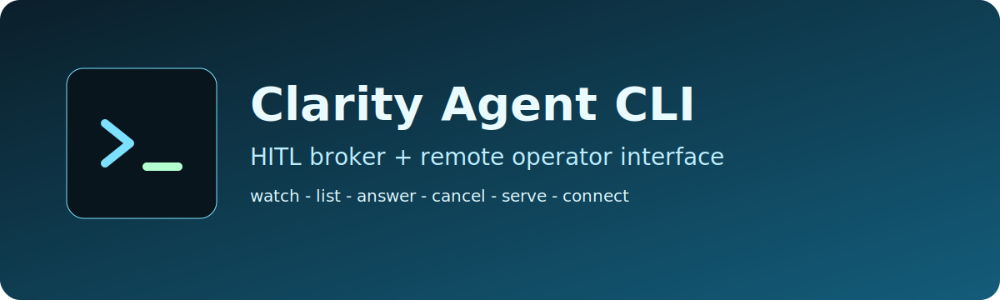

<p align="center">
  
</p>

<p align="center">
  <strong>Native Clarity CLI for runtime-agent chat and HITL operator actions.</strong>
</p>

---

`clarity-agent-cli` is now implemented in Clarity and packaged as a native Clarity launcher.

## Status

Implemented commands:

- `runtime-chat` — connect to runtime, select agent, and chat
- `runtime-agents` — list runtime agent services
- `connect` — connect to a remote HITL broker (`/questions`, `/answer`)
- `watch` — poll local `.question` files and answer interactively
- `list` — list pending local questions
- `answer` — write a local `.answer` file for file-protocol HITL
- `cancel` — remove a pending local question file
- `serve` — host broker HTTP API (`/questions`, `/questions/:key`, `/answer`, `/cancel`, `/events`)

## Operator UX command

Use `claritycli` for the streamlined chat UX:

- default target when no args are provided: `http://localhost:4707`
- arrow-key (`up/down`) agent selection
- simple chat transcript:
  - `you> ...`
  - `bot> ...`

`claritycli` accepts:

```bash
claritycli [runtime-url] [--token <secret>] [--no-tty-select]
```

- Arrow-key selection is enabled by default when running in a TTY, with automatic numeric fallback if raw key input is unavailable.
- Use `--no-tty-select` to force numeric selection.
- Runtime auth token precedence: `--token` -> `CLARITY_RUNTIME_TOKEN` -> disabled.

## Install and run

```bash
npm install
npm run build

# show help
npx clarity-agent --help

# streamlined operator UX (defaults to localhost:4707)
npx claritycli

# list runtime agents
npx clarity-agent runtime-agents http://localhost:4707

# single-start runtime chat flow
npx clarity-agent runtime-chat http://localhost:4707

# connect to remote broker
npx clarity-agent connect http://localhost:7842

# start broker HTTP server
npx clarity-agent serve --port 7842

# write local answer file
npx clarity-agent answer review-step-3 "Looks good"
```

## Install direct commands (no npx)

```bash
npm install
npm run install:bin

# now callable directly
claritycli
clarity-agent --help
```

Notes:

- By default, commands are linked into `~/.local/bin`.
- Override install target with `CLARITY_BIN_DIR=/your/bin npm run install:bin`.
- If needed, add to shell path: `export PATH="$HOME/.local/bin:$PATH"`.

## CLI commands

```bash
clarity-agent runtime-chat [runtime-url] [service-id] [--agent <agent-id>] [--run-id <run-id>] [--resume-latest] [--token <secret>] [--poll-ms <ms>] [--events-limit <n>] [--no-stream]
clarity-agent runtime-agents [runtime-url] [--token <secret>]
clarity-agent connect [broker-url] [--token <secret>] [--poll-ms <ms>] [--timeout <secs>] [--auto-approve]
clarity-agent watch [dir] [--dir <path>] [--timeout <secs>] [--auto-approve] [--log <file>] [--poll-ms <ms>]
clarity-agent list [dir] [--dir <path>]
clarity-agent answer <key> <response> [--dir <path>]
clarity-agent cancel <key> [dir] [--dir <path>]
clarity-agent serve [dir] [--dir <path>] [--port <port>] [--token <secret>] [--allow-query-token]
```

## Runtime chat flow

1. Start `runtime-chat`.
2. Connect to runtime and fetch `/api/agents/registry`.
3. Select numbered agent service.
4. Bootstrap run (`agent.run_created`, `agent.run_started`) unless `--run-id` is provided.
5. Chat via `POST /api/agents/runs/:runId/messages`.
6. Receive events by SSE (`/api/agents/runs/:runId/events/stream`) with polling fallback.

## Token handling

- Runtime commands (`runtime-chat`, `runtime-agents`, `claritycli`) resolve tokens with:
  1. `--token <secret>`
  2. `CLARITY_RUNTIME_TOKEN`
  3. empty token
- Broker commands (`connect`, `serve`) resolve tokens with:
  1. `--token <secret>`
  2. `CLARITY_HITL_BROKER_TOKEN`
  3. empty token

## Broker security profile

- `serve` authenticates with `Authorization: Bearer <token>` when a token is configured.
- Query-string token auth is disabled by default and only enabled with `--allow-query-token`.
- For non-local deployments, put broker traffic behind TLS and network policy controls.

## Project structure

```text
.
|-- clarity/
|   |-- main.clarity
|   |-- claritycli.clarity
|   |-- runtime-chat/runtime-chat.clarity
|   |-- runtime-agents/runtime-agents.clarity
|   |-- connect/connect.clarity
|   |-- watch/watch.clarity
|   |-- list/list.clarity
|   |-- cancel/cancel.clarity
|   |-- answer/answer.clarity
|   `-- serve/serve.clarity
|-- docs/
|   |-- hitl-broker-spec.md
|   |-- runtime-agent-chat-spec.md
|   `-- clarity-language-gap-requirements.md
|-- tests/
|   `-- cli.test.mjs
`-- scripts/
    `-- check-pure-clarity.sh
```

## Quality gates

```bash
npm run build
npm run lint
npm run test
```

## Notes

- `runtime-chat` is fully Clarity-native.
- `claritycli` is fully Clarity-native (`clarity/claritycli.clarity` -> `dist/claritycli.cjs`).
- Distribution is generated with `clarityc pack` into `dist/clarity-agent.cjs` from `clarity/main.clarity`.
- Lint enforces Clarity-first implementation policy for this repository.
